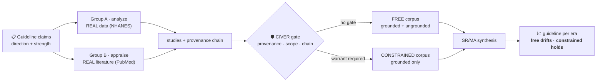

# MedEvo

### Is AI quietly rewriting clinical guidelines — and can a provenance gate stop it?


MedEvo is a simulated scientific ecology. AI agents do real research over real
data; their work accumulates into the corpus a guideline is synthesized from; and
we watch whether the guideline **drifts** — and whether a pre-execution
provenance gate (**CIVER**) holds it on the trajectory the real evidence
supports.

---

## The problem

Evidence-based medicine assumes the literature is a faithful record of what was
actually studied. But AI now writes, summarizes, and synthesizes biomedical
evidence at scale. When poorly-grounded or fabricated findings launder through
systematic reviews into authoritative recommendations, a guideline can shift in
**direction** or **strength** — and no one sees the moment it happens.

MedEvo makes that moment visible, and tests one defense against it.

## The demonstration

We replay a **real historical reversal**: hormone therapy (HRT) for chronic-disease
prevention. Before 2002 it was recommended to *prevent* heart disease; the WHI
trials reversed that, and the USPSTF has recommended *against* it (grade D) ever
since. A trustworthy instrument should re-live that flip from the literature of
each era — and the gate should keep the guideline on course while an ungated arm
drifts (the figure above).



Agents are deliberately fallible — **their failures are the phenomenon, not a
script.** A weak agent over-reaches or cites evidence that doesn't resolve; that
ungrounded work is the contamination, emerging on its own at a rate anchored to a
measured quantity, never injected by us. The gate judges only provenance and
scope — never a "this one is fake" label — so the contrast it produces is real,
and it can fail.

The headline number is the leakage- and competence-cancelled gap between the two
arms, with confidence intervals on both axes, benchmarked against the real USPSTF
trajectory and checked against volume-matched and random-gate controls. MedEvo's
claim is **auditable corruption-resistance** — never "AI that writes more correct
guidelines." It is a research instrument, not clinical decision support.

## How it works

| Tier | Role |
|---|---|
| **1 · Research agents** | 50/50: Group A runs real statistics on raw datasets (NHANES) in a sandbox; Group B appraises real PubMed literature date-cut to each era. |
| **2 · CIVER gate** | A study enters the inheritable corpus only if its evidence resolves and its claim does not over-reach its scope. |
| **3 · Accumulating DB** | Branch-partitioned — constrained holds warranted studies only; free holds everything. This is what the next era inherits. |
| **4 · SR/MA synthesis** | LLM agents read **only** the accumulated corpus and emit each era's guideline: direction + a GRADE-style strength. |

## Status

The v3 engine is built and tested end-to-end; the HRT demonstration is wired
(real NHANES + PubMed, USPSTF ground truth verified from the primary source);
a scored verdict on a frontier model is the next step. Local open-weight models
are too weak for agent research and run as *illustrative* only — scored runs use
a frontier model.

## Run

```bash
cd services/worker && python3.11 -m venv .venv && source .venv/bin/activate
pip install -e ".[dev]"

export OPENROUTER_API_KEY=...
python -m scripts.evaluate --topic hrt \
  --backend openai-compatible --base-url https://openrouter.ai/api/v1 \
  --model deepseek/deepseek-v4 --horizons 2000,2010,2020
```

Static replay site: `npm run build:static --prefix apps/web`.
Tests: `cd services/worker && ./.venv/bin/pytest`.

## Author

**Tuyen Tran, MD** — pediatric surgeon working at the intersection of
evidence-based medicine, AI, and low-resource clinical settings. ORCID
[0009-0003-0535-6225](https://orcid.org/0009-0003-0535-6225).

A research instrument, not clinical decision support. Nothing it outputs should
inform the care of an actual patient.
