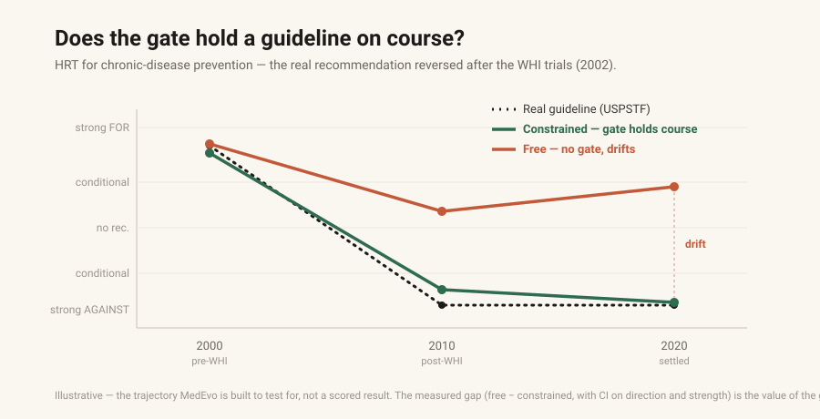
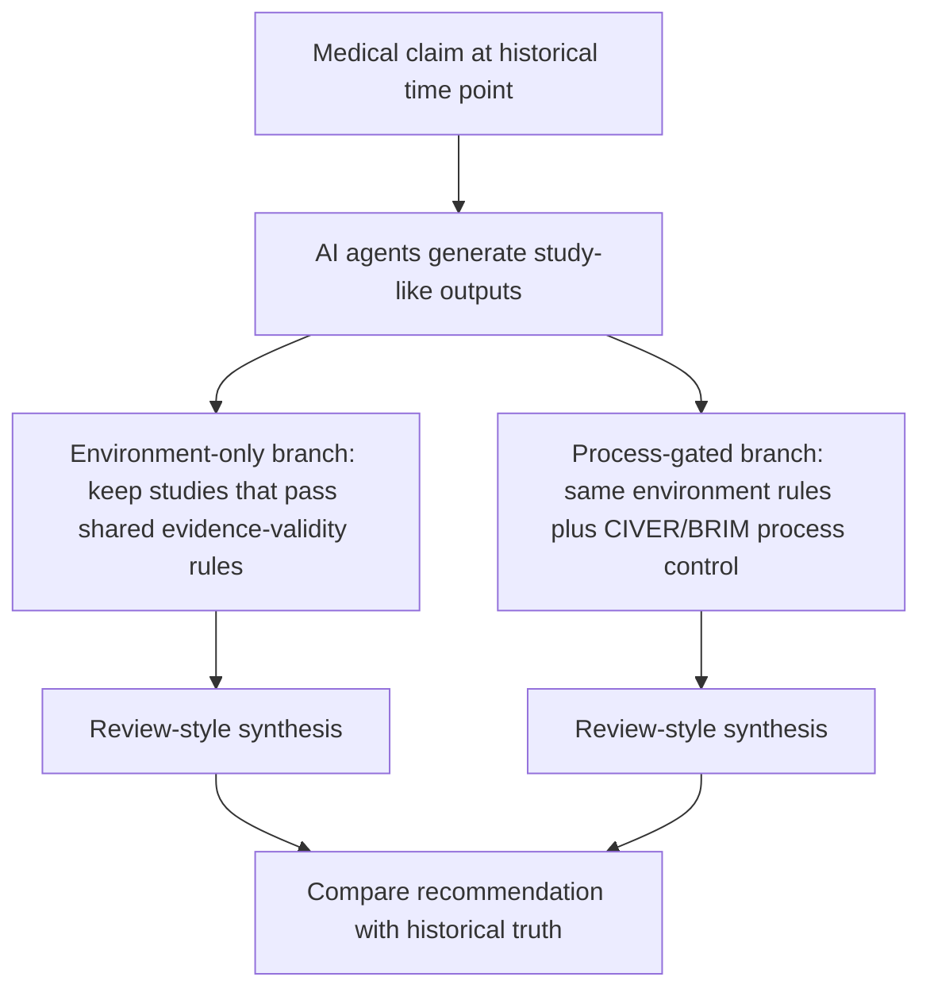

# MedEvo

**MedEvo** stands for **Medical Evolution**.

It is a research simulator for asking a simple question:

> If AI-generated biomedical studies start entering the evidence base, can they change the recommendations that later reviews and guidelines would produce?

MedEvo does not write clinical guidelines. It does not give patient-care advice. It is an evaluation tool for studying how evidence pipelines can drift.



## What MedEvo Does

MedEvo simulates the path from a clinical claim to a guideline-like recommendation.

1. Start with a medical claim.
2. Choose historical time points, such as 2000, 2012, and 2024.
3. Let AI research agents generate study-like outputs using only evidence available up to each time point.
4. Let those studies accumulate into an evidence corpus.
5. Run a systematic-review / meta-analysis style synthesis over that corpus.
6. Compare the resulting recommendation against the known historical trajectory.

The key measurement is whether a recommendation moves away from the historical truth trajectory after AI-generated studies accumulate.

## Why It Exists

Clinical medicine does not act on isolated hypotheses. It acts through an evidence pipeline:


If AI systems can produce large volumes of biomedical research-like text, the important safety question is not only whether each output looks plausible. The downstream question is whether many such outputs, once accumulated, can distort the evidence base that reviews and guidelines depend on.

MedEvo is built to test that downstream failure mode.

## Two Evidence Ecologies

Each simulation runs two branches.



| Branch | What it keeps | Purpose |
|---|---|---|
| Environment-only | Studies that cite retrieved evidence, stay within source scope, and respect the time cutoff | Baseline MedEvo control: evidence-valid outputs without extra process control |
| Process-gated | The same environment-valid outputs, but only when the research process also passes CIVER/BRIM checks | Tests whether process control reduces downstream drift beyond baseline evidence validity |

Both branches share MedEvo environment validity rules before a study can enter the corpus:

- cited identifiers must resolve in the retrieved date-cut evidence set
- claimed scope must stay within the cited evidence
- evidence must not post-date the simulated year

The process-gated branch adds two process checks in this repository:

- **CIVER**, the claim-evidence integrity check, tests whether the claim, method, evidence, analysis, and conclusion form a coherent chain.
- **BRIM**, the plan-execution monitor, tests whether execution stays aligned with the declared plan instead of drifting during the research process.

These checks are not truth oracles. They do not say a medical conclusion is correct. They test whether a generated study has a traceable, bounded, and internally coherent research process.

## Historical Reversal Test

MedEvo uses historical medical reversals as validation targets. A useful simulator should be able to replay known shifts in evidence.

Example: hormone therapy for chronic-disease prevention in postmenopausal women.

- Before 2002, preventive hormone therapy was widely supported or accepted.
- In 2002, the Women's Health Initiative changed the evidence trajectory.
- Later guidance recommended against preventive use.

The simulator asks whether each branch can track that reversal when it only sees evidence available at each simulated time point.

## Current Results

The repository currently includes two scored benchmark runs.

### Run 1: 4 cardiovascular claims

Run 1 used Claude Sonnet 4.6 on four cardiovascular claims.

It showed that MedEvo can detect recommendation drift, but the gated and ungated branches ended with the same guideline-level distance from truth. The model was strong enough that too few bad studies entered the corpus for the gate to make a visible difference at the final recommendation level.

### Run 2: 30 claims across 6 medical domains

Run 2 used MIMO-v2.5-pro on 30 claims across cardiovascular medicine, surgery/procedures, pharmacotherapy, screening, metabolic disease, and infectious disease.

Summary:

| Measure | Result |
|---|---:|
| Claims | 30 |
| Medical domains | 6 |
| Historical horizons | 2000, 2012, 2024 |
| Model calls | 1,032 |
| Approximate tokens | 16M |
| Ungated distance to truth | 0.346 |
| Gated distance to truth | 0.250 |
| Improvement | 0.096 |

Lower distance is better. A score of 0 would mean the simulated recommendation exactly matches the historical truth label used by the benchmark.

Run 2 is the first benchmark where the process gate reduced guideline-level drift. It also beat a volume-matched random-filter baseline, meaning the improvement was not explained only by keeping fewer studies.

This is still an early result: one model, one seed, a modest margin, and a high abstention rate in the weaker model.

Full Run 2 report: [`docs/runs/RUN_2_30CLAIM_MIMO.md`](docs/runs/RUN_2_30CLAIM_MIMO.md)  
Short abstract: [`docs/runs/RUN_2_ABSTRACT.md`](docs/runs/RUN_2_ABSTRACT.md)

## What Is In This Repository

```text
apps/web/                         Static replay UI
apps/web/replay-fixtures/         Frozen public replay artifacts
services/worker/                  Simulation engine and evaluators
services/worker/data/ground_truth Historical truth trajectories
docs/runs/                        Benchmark reports
docs/reversal.svg                 Historical reversal schematic
```

The public demo is a static replay. It does not call live model APIs, does not require a database, and does not contain patient data.

## Replay The Static Demo

```bash
npm install
npm run build:static --workspace @medevo/web
python3 -m http.server 4173 -d apps/web/out
```

Then open:

```text
http://127.0.0.1:4173/
```

## Run The Worker Locally

```bash
cd services/worker
python3.11 -m venv .venv
source .venv/bin/activate
pip install -e ".[dev]"
```

Replay from cache only:

```bash
MEDEVO_LLM_CACHE_ONLY=1 python -m scripts.evaluate \
  --topic hrt \
  --backend claude-cli \
  --dry-run
```

Run with an OpenAI-compatible backend:

```bash
python -m scripts.evaluate --topic hrt \
  --backend openai-compatible \
  --base-url https://openrouter.ai/api/v1 \
  --model deepseek/deepseek-v4 \
  --api-key-env OPENROUTER_API_KEY \
  --horizons 2000,2012,2024
```

Run with Claude CLI:

```bash
python -m scripts.evaluate --topic hrt \
  --backend claude-cli \
  --model claude-sonnet-4-6 \
  --horizons 2000,2012,2024
```

Run tests:

```bash
cd services/worker
./.venv/bin/pytest
```

Live model calls are cached by default in `services/worker/data/llm_cache`, which is gitignored. Use `MEDEVO_LLM_CACHE_ONLY=1` to prevent fresh model calls.

## Safety Boundary

MedEvo is for evaluation, audit, and methodological research.

It is not clinical decision support. Its outputs should not be used to diagnose, treat, or guide care for any patient.

## Author

Tuyen Tran, MD  
Pediatric surgeon working on evidence-based medicine, AI evaluation, and low-resource clinical settings.  
ORCID: [0009-0003-0535-6225](https://orcid.org/0009-0003-0535-6225)

## Citation

A formal citation will be added after the first archived release.

For now:

```bibtex
@software{tran_medevo_2026,
  author = {Tran, Tuyen},
  title = {MedEvo: Medical Evolution, a simulator for clinical evidence drift},
  year = {2026},
  url = {https://github.com/tuyentran-md/medevo}
}
```
