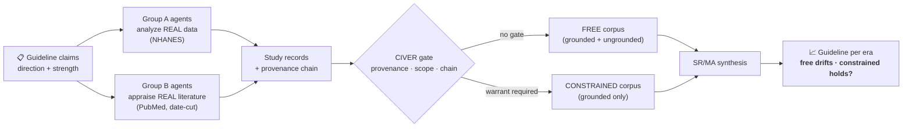

# MedEvo

**A simulated scientific ecology that shows whether AI is quietly rewriting clinical guidelines — and whether a provenance gate can stop it.**

---

## The problem

AI now writes, summarizes, and synthesizes biomedical evidence at scale. That
evidence flows into the corpus that guideline panels read. If poorly-grounded or
fabricated findings launder through systematic reviews into authoritative
recommendations, a guideline can **drift** — its direction or its strength of
recommendation moving away from what the real evidence supports — and nobody sees
the moment it happens.

So the question MedEvo exists to answer:

> When a community of AI research agents does the science, does the resulting
> clinical guideline drift — and does a pre-execution **provenance gate (CIVER)**
> measurably hold it on course?

## The demonstration

MedEvo replays a **real historical guideline reversal** and asks whether the
simulated ecology reproduces it — and whether the gate protects it.

The case: **hormone therapy (HRT) for chronic-disease prevention.** Before 2002,
HRT was widely recommended to *prevent* cardiovascular disease. The Women's Health
Initiative trials (2002, 2005) reversed that, and the USPSTF has recommended
*against* it (grade D) ever since. A faithful instrument should re-live that
flip from the literature of each era.



The headline output is the contrast: as fallible agents accumulate work across
the eras, does the **free** arm drift off the real USPSTF trajectory while the
**constrained** (gated) arm tracks it?

*Illustrative — the trajectory the gate is tested to preserve, not a scored
result:*

| Era | Real recommendation (USPSTF) | 🟢 Constrained (CIVER) | 🔴 Free (no gate) |
|---|---|---|---|
| ~2000 (pre-WHI) | HRT recommended *for* prevention | matches era | matches era |
| ~2010 (post-WHI) | recommend **against** (grade D) | flips to *against* | lags — drifts toward *for* |
| ~2020 | sustained strong **against** | strong *against* (tracks truth) | off-trajectory / weakened |

That gap — with confidence intervals, on both the *direction* and the *strength*
axis, and surviving controls — is the measure of the gate's value. A sealed run
is replayed as a static animation (no live compute), so the demonstration is
reproducible and inspectable by anyone.

## Why the result is honest, not staged

The hard part of any "defense beats attack" demo is circularity: if the designer
injects the contamination *and* builds the gate to catch it, the gate wins by
construction and proves nothing.

MedEvo avoids this:

- **Contamination is never authored.** It *emerges* from the agents' own failures
  — a weak or over-reaching agent produces an ungrounded claim, at a rate anchored
  to a measured quantity (LLM "structural validity without direction-fidelity"),
  not a tuned dial.
- **The gate is blind.** It judges only chain integrity, evidence resolvability,
  and claim scope — never a "this one is fake" label. It catches fabrication and
  over-reach; it does **not** catch an honestly-grounded analysis that is simply
  wrong (that drifts both arms equally and cancels in the contrast).
- **The yardstick is internal.** Value is scored as displacement from a
  *no-contamination counterfactual* of the same ecology, and must survive
  volume-matched and random-gate controls. The test can fail.

MedEvo's claim is therefore **auditable corruption-resistance** — not "AI that
writes more correct guidelines." It is a research instrument, never clinical
decision support.

## How it works

| Tier | Role |
|---|---|
| **1 — Research agents** | 50/50 split: Group A runs real statistics on raw datasets (NHANES) in a sandbox; Group B appraises real PubMed literature, date-cut to each era. Each emits a structured study with a provenance chain. |
| **2 — CIVER gate** | A pre-execution admissibility check (Article I): a study enters the inheritable corpus only if its evidence resolves and its claim scope does not over-reach. |
| **3 — Accumulating DB** | Branch-partitioned: the constrained corpus holds warranted studies only; the free corpus holds everything. This is what the next era inherits. |
| **4 — SR/MA synthesis** | LLM-driven agents read **only** the accumulated corpus (no re-querying) and emit each era's guideline: direction + a GRADE-style strength level. |

Drift is measured on a 2-D lattice (direction × strength). The gate's value is the
leakage- and competence-cancelled gap between the free and constrained arms,
benchmarked against the real USPSTF trajectory.

## Status

The v3 engine is built and tested end-to-end; the HRT demonstration is wired
(real NHANES + PubMed, USPSTF ground truth verified from the primary source).
A scored verdict on a cloud flagship model is the next step. Local open-weight
models are too weak for agent research and are treated as illustrative only —
scored runs require a frontier model.

## Run

```bash
cd services/worker && python3.11 -m venv .venv && source .venv/bin/activate
pip install -e ".[dev]"

export OPENROUTER_API_KEY=...
python -m scripts.evaluate --topic hrt \
  --backend openai-compatible --base-url https://openrouter.ai/api/v1 \
  --model deepseek/deepseek-v4 --horizons 2000,2010,2020
```

Static replay site: `NEXT_PUBLIC_MEDEVO_STATIC_REPLAY=1 npm run build:web`.
Tests: `cd services/worker && ./.venv/bin/pytest` and `npm run build:web`.

## Author

**Tuyen Tran, MD** — pediatric surgeon working at the intersection of
evidence-based medicine, AI, and low-resource clinical settings. ORCID
[0009-0003-0535-6225](https://orcid.org/0009-0003-0535-6225).

A research instrument, not clinical decision support. Nothing it outputs should
inform the care of an actual patient.
