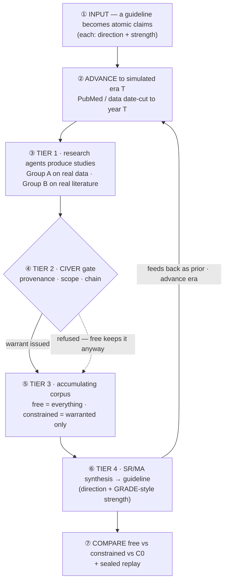
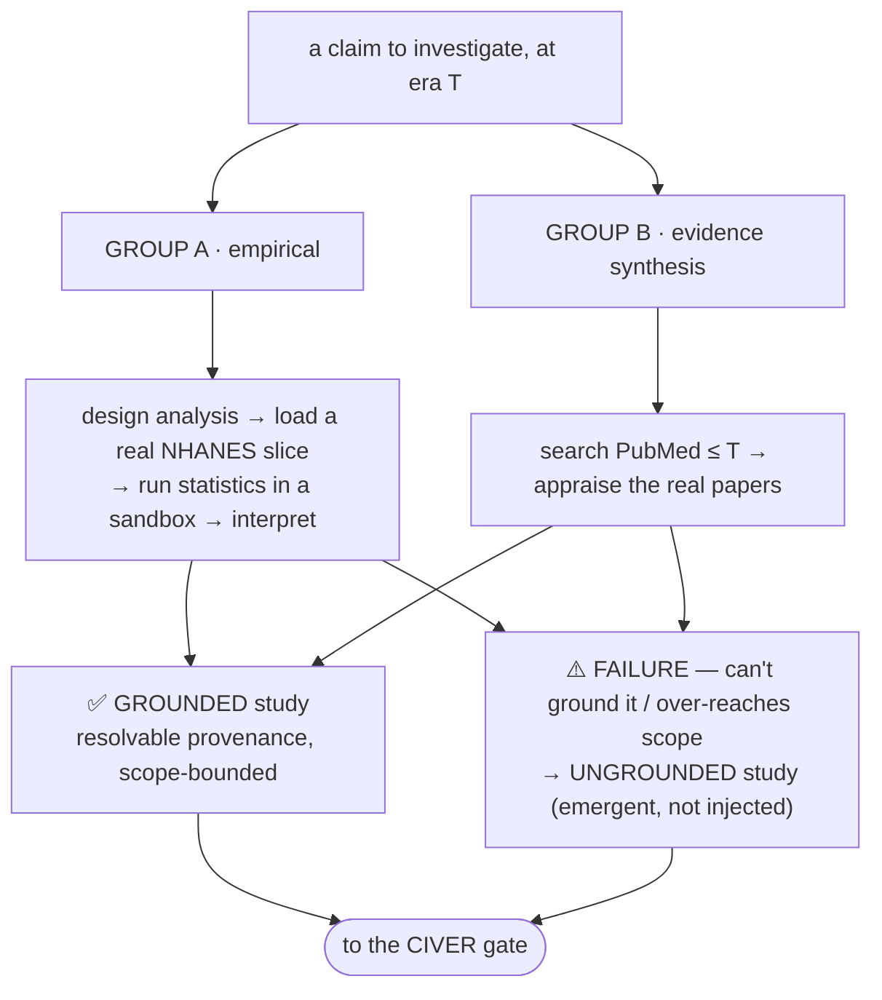
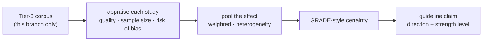
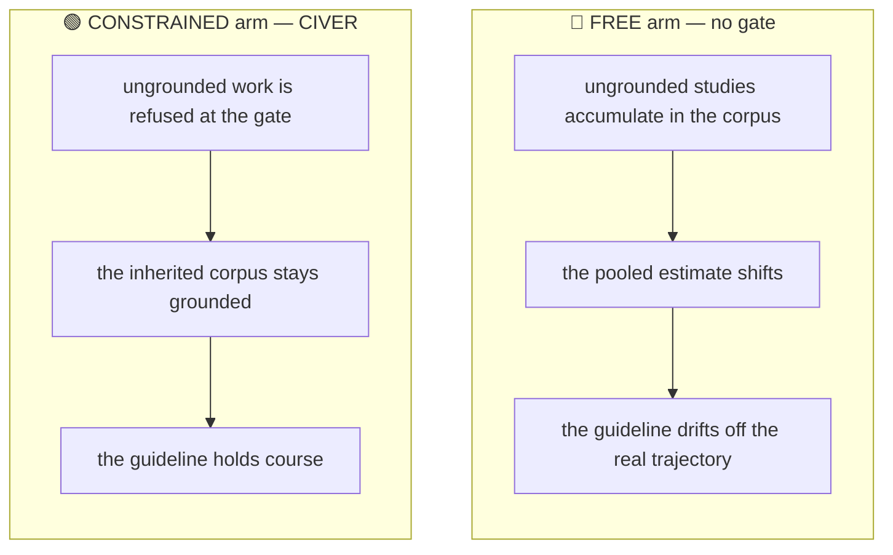

# MedEvo

### Is AI quietly rewriting clinical guidelines — and can a provenance gate stop it?


MedEvo is a **simulated scientific ecology**. AI agents do real research over real
data and literature; their work accumulates into the corpus a guideline is
synthesized from; and we watch whether the guideline **drifts** — and whether a
pre-execution provenance gate (**CIVER**) holds it on the trajectory the real
evidence supports.

---

## The problem

Evidence-based medicine assumes the literature is a faithful record of what was
actually studied. AI now writes, summarizes, and synthesizes that literature at
scale. When poorly-grounded findings launder through systematic reviews into
authoritative recommendations, a guideline can shift in **direction** or
**strength** — silently. MedEvo makes that moment visible, and tests a defense.

## The pipeline — stage by stage



We replay a **real historical reversal** to validate the instrument: hormone
therapy (HRT) for chronic-disease prevention — recommended *for* prevention
before 2002, reversed by the WHI trials, USPSTF grade D *against* ever since
(the figure at the top). A faithful ecology should re-live that flip from each
era's literature; the gate should hold the guideline on course while an ungated
arm drifts.

## The simulated researchers (Tier 1)

Agents do research the way people do — and **fail the way fallible researchers
do.** That failure, not an injected fake, is the contamination.



The failure *rate* is anchored to a measured quantity (how often LLMs produce
structurally-valid but unfaithful claims), never a tuned dial.

## The synthesis model (Tier 4 · SR/MA)

Synthesis agents read **only** the accumulated corpus — never re-querying the
world — exactly as a real guideline panel works from the published record.



## How drift emerges — and how the gate answers it



The gate judges only provenance, scope, and chain integrity — never a
"this one is fake" label — so it catches fabrication and over-reach but not an
honest analysis that is simply wrong (that drifts both arms equally and cancels).
The headline is the leakage- and competence-cancelled **gap** between the arms,
with confidence intervals on both axes, benchmarked against the real USPSTF
trajectory and checked against volume-matched and random-gate controls. MedEvo's
claim is **auditable corruption-resistance** — never "AI that writes more correct
guidelines."

## Status

The v3 engine is built and tested end-to-end; the HRT demonstration is wired
(real NHANES + PubMed, USPSTF ground truth verified from the primary source);
a scored verdict on a frontier model is the next step. This is a research
instrument, not clinical decision support.

## Run

```bash
cd services/worker && python3.11 -m venv .venv && source .venv/bin/activate
pip install -e ".[dev]"

python -m scripts.evaluate --topic hrt \
  --backend openai-compatible --base-url https://openrouter.ai/api/v1 \
  --model deepseek/deepseek-v4 --api-key-env OPENROUTER_API_KEY \
  --horizons 2000,2010,2020
```

Or spend a Claude subscription as the model (no API key — uses the local `claude` CLI):

```bash
python -m scripts.evaluate --topic hrt --backend claude-cli \
  --model claude-sonnet-4-6 --horizons 2000,2010,2020
```

Cheap lane via Google AI Studio Gemini API (uses `GEMINI_API_KEY`, default model
`gemini-3-flash`, default base URL `https://generativelanguage.googleapis.com/v1beta/openai`):

```bash
python -m scripts.evaluate --topic cvd --backend gemini --max-calls 500
```

Run-ops guardrails before spending model calls:

```bash
cd services/worker
./.venv/bin/python -m scripts.evaluate --topic cvd --backend claude-cli --dry-run
./.venv/bin/python -m scripts.evaluate --topic cvd --backend claude-cli --max-calls 500
```

Live LLM calls are cached by default in `services/worker/data/llm_cache` (gitignored).
Set `MEDEVO_LLM_CACHE_ONLY=1` to replay only cached responses, or
`MEDEVO_LLM_CACHE=0` to force fresh calls.

Static replay site: `npm run build:static --prefix apps/web`.
Tests: `cd services/worker && ./.venv/bin/pytest`.

## Author

**Tuyen Tran, MD** — pediatric surgeon working at the intersection of
evidence-based medicine, AI, and low-resource clinical settings. ORCID
[0009-0003-0535-6225](https://orcid.org/0009-0003-0535-6225).

A research instrument, not clinical decision support. Nothing it outputs should
inform the care of an actual patient.
