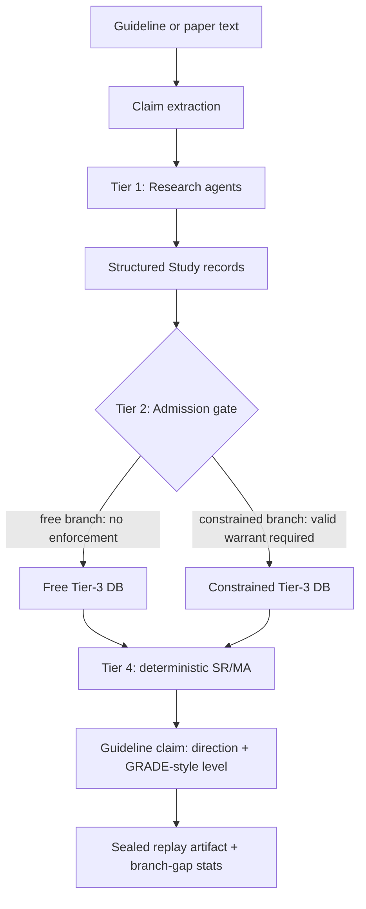

# MedEvo

MedEvo is a research instrument for simulating how an AI-contaminated biomedical
literature can change downstream clinical recommendations.

The core question is narrow:

> If synthetic or poorly grounded studies enter the inheritable evidence corpus,
> does a later guideline drift in direction or recommendation level, and does a
> provenance gate reduce that drift?

MedEvo is not clinical decision support and does not predict the future of any
real guideline. It simulates provenance dynamics: what happens when a guideline
panel synthesizes from a corpus whose contents may have been contaminated.

## Current Status

This repo now implements the v2 engine shape:

- Tier-1 research agents produce structured study records.
- Tier-2 admission gates decide what enters the constrained inheritable corpus.
- Tier-3 stores an accumulating, branch-partitioned study database.
- Tier-4 performs deterministic simulated SR/MA over that database.
- Direction and recommendation level are separate outputs.
- Runs emit sealed artifacts with lineage, warrants, audit events, DB growth,
  guideline timelines, and branch-gap population statistics.

What is not complete yet: a scored scientific proof run. The code can produce
the artifact and validation surfaces, but a real Phase A/Phase B experiment still
needs a chosen historical window, gold set, real model backend, and repeated runs
for confidence intervals. Fallback or showcase runs are mechanism demos only.

## Architecture



The two branches run the same engine:

- `free`: admits generated studies and contamination without enforcing the gate.
- `constrained`: only warranted outputs enter the inheritable Tier-3 corpus.

The branch contrast is the point. A useful run must show whether the constrained
corpus changes guideline outcomes relative to the free corpus, and whether that
gap survives controls.

## Scientific Boundaries

MedEvo does not claim clinical truth.

- Real PubMed-grounded studies may carry extracted effect estimates when present.
- Qualitative real-grounded studies are allowed when abstracts do not expose a
  clean numeric effect.
- Synthetic studies are deliberate contamination carriers.
- The pooled effect in MedEvo is a simulated synthesis signal, not a publication
  grade meta-analysis.
- A run is marked non-scientific if it uses the deterministic fallback client.

The result to interpret is evidentiary lineage and corpus contamination, not a
medical recommendation for patient care.

## Engine Modules

```text
apps/web
  Next.js UI for creating runs and replaying sealed artifacts.

packages/contracts
  Shared TypeScript contracts used by the web app.

services/worker/app
  agents.py       Tier-1 ResearchAgent and Tier-4 SrmaAgent
  db.py           SQLite runs, audit trail, warrants, Tier-3 study DB
  ecology.py      branch simulation loop, audit chain, artifact assembly
  harness.py      Phase A/Phase B validation bars and bootstrap CI
  llm.py          model clients, frozen prompts, fallback firewall
  pubmed.py       PubMed client, date-cut search, cache, effect extraction
  synthesis.py    deterministic SR/MA pooling and recommendation level logic
```

## Artifact Schema

Completed runs expose:

- `snapshots`: horizon views for `free` and `constrained` branches.
- `branch_diff`: per-year, per-claim 2D drift score.
- `lineage`: surviving real sources, lost real sources, synthetic carriers.
- `warrants`: execution warrant state for constrained outputs.
- `audit_trail`: hash-chained process events.
- `guideline_timeline`: per-claim direction and recommendation level by year.
- `db_growth`: replay counts for produced studies and emitted guidelines.
- `population_stats`: bootstrap CI for direction and level branch gaps.
- `bundle_seal`: tamper check for the sealed bundle.

## Validation Bars

The code includes two validation surfaces:

1. Phase A retrospective validation: clean-arm final guideline must beat
   baselines and remain stable across the final window.
2. Phase B forward value: free-vs-constrained branch gap must have bootstrap CI
   excluding zero on both direction and recommendation level, and must beat
   controls such as volume-matched or random-gate comparisons.

These bars are implemented in `services/worker/app/harness.py`; they do not by
themselves prove MedEvo's scientific claim. They are the scoring machinery for a
proper experiment.

## Local Development

Install JavaScript dependencies from the repo root:

```bash
npm install
```

Set up the worker:

```bash
cd services/worker
python3.11 -m venv .venv
source .venv/bin/activate
pip install -e ".[dev]"
uvicorn app.main:app --reload
```

Start the web app:

```bash
NEXT_PUBLIC_MEDEVO_WORKER_URL=http://127.0.0.1:8000 npm run dev:web
```

Default worker endpoint: `http://127.0.0.1:8000`

Default web endpoint: `http://127.0.0.1:3000`

## Model Backends

The worker supports:

- `ollama` with `MEDEVO_OLLAMA_BASE_URL` and `MEDEVO_OLLAMA_MODEL`.
- OpenAI-compatible chat-completions endpoints via per-request `base_url`,
  `model`, and BYOK API key.

Defaults:

```bash
MEDEVO_OLLAMA_BASE_URL=http://127.0.0.1:11434
MEDEVO_OLLAMA_MODEL=gemma3:12b
MEDEVO_MAX_CONCURRENT_RUNS=3
```

If the selected backend is unreachable, MedEvo falls back to a deterministic
client and stamps the run as illustrative, not scientific.

## Tests

Backend:

```bash
cd services/worker
./.venv/bin/pytest
```

Web:

```bash
npm run lint:web
npm run build:web
```

Current backend test coverage includes:

- PubMed date-cut/cache behavior.
- SRMA no-PubMed import isolation.
- independent recommendation level movement with direction held fixed.
- admission gate behavior for free vs constrained Tier-3 DB.
- audit-chain and bundle-seal verification.
- Phase A/Phase B harness behavior.

## Running A Proper Scientific Pass

A meaningful run requires:

1. Choose a historical guideline window and a later real guideline target.
2. Build a gold set for evidentiary lineage outcomes, not medical truth claims.
3. Run Phase A clean-arm validation against baselines.
4. Run Phase B free-vs-constrained forward simulation.
5. Report CI for direction and level gaps, plus volume-matched and random-gate
   controls.

If Phase A fails, Phase B is uninterpretable. If Phase B's CI includes zero or
the gap disappears under controls, the constitution/gate did not show measurable
value in that experiment.

## Author

Tuyen Tran, MD — pediatric surgeon building tools at the intersection of
evidence-based medicine, AI, and low-resource clinical settings. ORCID
[0009-0003-0535-6225](https://orcid.org/0009-0003-0535-6225).

This is a research instrument, not clinical decision support. Nothing it outputs
should inform the care of an actual patient.
