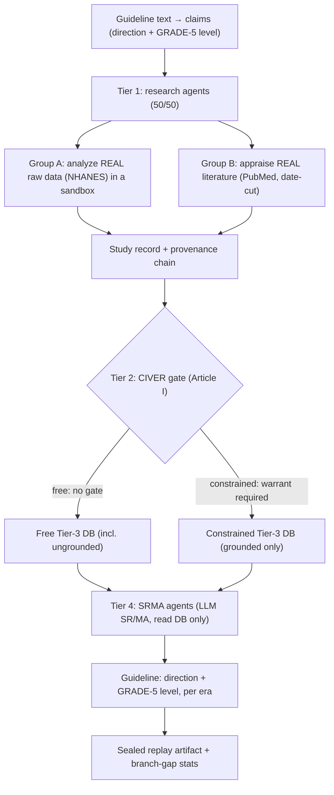

# MedEvo

MedEvo is a research instrument that simulates how a community of AI research
agents, working over real evidence, can let a clinical guideline **drift** — and
whether a provenance-integrity gate (CIVER) reduces that drift.

The core question is narrow:

> When fallible AI agents do research and their work accumulates into the
> evidence corpus a guideline panel synthesizes from, does the guideline drift
> in direction or recommendation level — and does a pre-execution provenance
> gate measurably reduce that drift?

MedEvo is **not** clinical decision support and does not predict any real
guideline. It simulates the *provenance dynamics* of an evidence ecology.

## What makes this non-circular

A naive version of this experiment hand-injects fake "contamination" studies and
then has a gate block them. That is circular: the designer authors both the
attack and the defense, so the gated arm wins by construction, and the "drift"
is just the designer's hand.

MedEvo avoids this. **Contamination is not authored by the harness — it emerges
from the agents' own failures.** Agents attempt real research; a weak or
over-reaching agent sometimes emits an *ungrounded* study (a claim whose evidence
chain does not resolve, or whose scope over-reaches its evidence). The realistic
*rate* of this failure is anchored to a measured quantity (the A0 study of LLM
"structural validity without direction-fidelity"), not a tuned dial. The gate
never sees a "this one is fake" label — it judges only chain integrity, evidence
resolvability, and claim scope.

Consequently the gate catches **fabrication / unresolvable provenance / scope
over-reach** ("dối"), but **not** an honestly-grounded analysis that reaches a
wrong conclusion ("dốt") — that has valid provenance, passes the gate, and drifts
both branches equally, cancelling in the contrast. MedEvo's claim is therefore
scoped to **auditable corruption-resistance**, never "AI produces more correct
guidelines."

## The four tiers



Tier-1 agents are deliberately fallible and cheap — their failures *are* the
phenomenon. Tier-4 SRMA agents read **only** the accumulated Tier-3 DB (no
re-querying PubMed/data — structurally enforced), so drift in the corpus
propagates into the guideline the way a real panel synthesizes from the
published record.

## Gold standard and ground truth

Two references, distinct roles:

- **C0 — the no-contamination counterfactual = the gold standard.** The same
  ecology, same seed, run with the failure rate driven to ~0. CIVER value is
  scored as *displacement from C0*: `d(free, C0) − d(constrained, C0)`, with a
  paired bootstrap CI on **both** the direction and the level axis, and it must
  survive a volume-matched control and a random-gate control. Because every arm
  shares the same fallible agents, both model-prior leakage and agent
  incompetence cancel in the contrast. C0 makes the test falsifiable: constrained
  may drift from C0 *more* than free.
- **USPSTF graded archive — the real-world anchor.** The retro scope is
  **hormone therapy (HRT) for chronic-disease prevention**, the documented
  reversal: pre-2002 HRT was recommended for prevention → the WHI 2002/2005 RCTs
  → USPSTF grade D ("recommends against"), sustained through 2022. The ground
  truth lives in a configurable fixture
  (`services/worker/data/ground_truth/hrt_uspstf.json`); Phase A checks whether
  the clean C0 reproduces this trajectory better than a no-change null. Real
  USPSTF letter grades are loaded from that fixture, never hardcoded in code.

## Status

The v3 engine core is built and tested (`services/worker`, full pytest green):

- Tier-1 Group-B (literature/PubMed) spine, emergent-failure model, CIVER gate,
  branch-partitioned Tier-3 DB, LLM SRMA.
- A0-anchored failure rate; realistic failure modes (unresolvable citation +
  scope over-reach); calibration confusion matrix (the gate is non-trivial —
  FNR > 0).
- C0 counterfactual + two-phase scoring + both controls; `scripts/evaluate.py`
  entrypoint printing replay counts and a PASS/FAIL verdict.
- Tier-1 Group-A (raw-data analysis) over real NHANES in a sandboxed subprocess.
- Sealed-bundle static web replay (`apps/web`, GitHub-Pages friendly).

**Not yet a positive scientific result.** The offline deterministic fixture run
returns Phase B = FAIL (CIVER value 0.0) — the intended *falsifiable* outcome on
a uniform fixture, not a bug. A real verdict requires a cloud flagship model + a
live PubMed/NHANES run. The HRT ground-truth grades are verified from the USPSTF
primary source, but their mapping onto atomic claims is a faithful interpretation
to be reviewed before any external claim.

## Scientific boundaries

- MedEvo does not claim clinical truth; it is not a truth oracle.
- The gate enforces structural/provenance integrity, not factual correctness.
- The pooled effect is a simulated synthesis signal, not a publication-grade
  meta-analysis.
- **NO-LOCAL rule:** local open-weight models are too weak to do real
  research-agent work, so a local (Ollama) run is *illustrative only* and is
  never stamped scientific. Scored runs require a cloud flagship.
- A run using the deterministic fallback client is stamped non-scientific.

## Engine modules

```text
apps/web
  Next.js UI; static sealed-bundle replay (set NEXT_PUBLIC_MEDEVO_STATIC_REPLAY=1).
packages/contracts
  Shared TypeScript contracts.
services/worker/app
  agents.py     Tier-1 ResearchAgent (emergent failure) + Tier-4 SrmaAgent
  microdata.py  Group-A NHANES loader + sandboxed analysis
  pubmed.py     PubMed client, date-cut search, cache, effect extraction
  ecology.py    branch loop, CIVER admission (chain + resolvability + scope), audit chain
  synthesis.py  SR/MA pooling + independent GRADE-5 level
  c0.py         C0 counterfactual, Phase A/B scoring, controls, evaluate()
  harness.py    bootstrap CI + branch-gap primitives
  db.py         SQLite runs, audit trail, warrants, Tier-3 study DB
  llm.py        model clients (cloud flagship scored; local illustrative), fallback firewall
```

## Running

Worker setup:

```bash
cd services/worker
python3.11 -m venv .venv
source .venv/bin/activate
pip install -e ".[dev]"
```

A scored evaluation run (cloud flagship, BYOK):

```bash
export OPENROUTER_API_KEY=...        # or OPENAI_/GEMINI_/ANTHROPIC_API_KEY
python -m scripts.evaluate \
  --topic hrt \
  --backend openai-compatible \
  --base-url https://openrouter.ai/api/v1 \
  --model deepseek/deepseek-v4 \
  --horizons 2000,2010,2020
```

Omitting a key/backend falls back to the deterministic illustrative client
(non-scientific). `--horizons` must be **absolute calendar years** (values < 1900
are clamped to the 2025 PubMed ceiling and collapse the retro).

Tests:

```bash
cd services/worker && ./.venv/bin/pytest
npm run lint:web && npm run build:web
```

## Author

Tuyen Tran, MD — pediatric surgeon building tools at the intersection of
evidence-based medicine, AI, and low-resource clinical settings. ORCID
[0009-0003-0535-6225](https://orcid.org/0009-0003-0535-6225).

This is a research instrument, not clinical decision support. Nothing it outputs
should inform the care of an actual patient.
